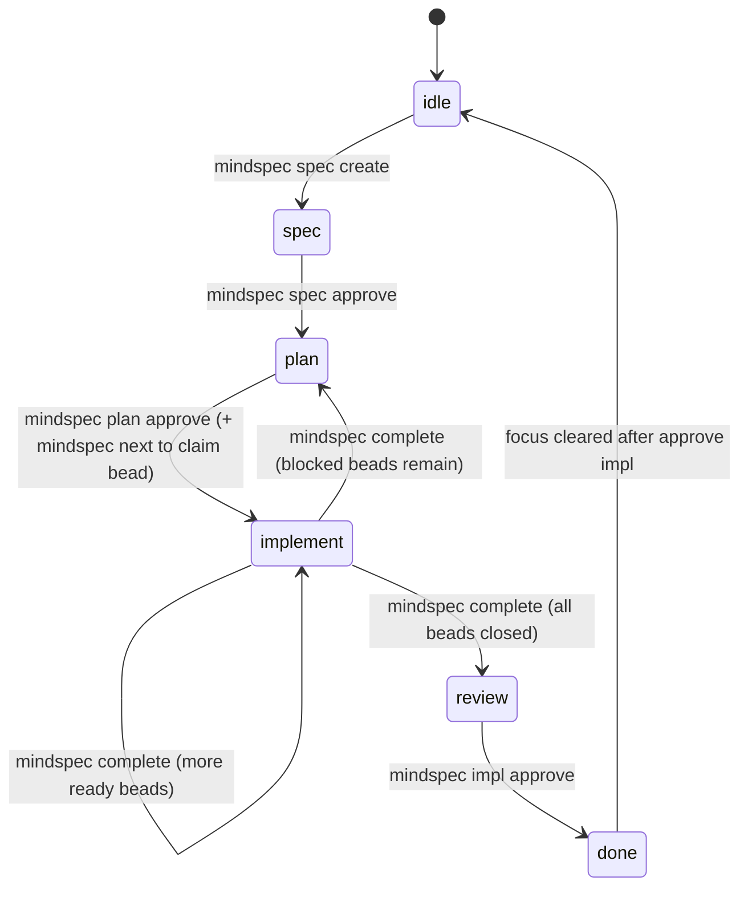

# MindSpec Workflow Architecture: State Machine and Transition Rules

This document defines the intended MindSpec workflow state machine in detail:

1. Which states exist
2. Which transitions are allowed
3. Which transitions are explicitly disallowed
4. Which command(s) trigger each transition
5. Which guards reject invalid transitions

This is the canonical transition contract for workflow behavior.

---

## State Model {#state-model}

MindSpec has two related but distinct state layers:

1. **Per-spec lifecycle phase** (authoritative): `.mindspec/docs/specs/<spec-id>/lifecycle.yaml`
2. **Current focus cursor** (routing): `.mindspec/focus`

And one execution substrate:

3. **Implementation work graph** (execution status): Beads epic + child beads

### 1) Lifecycle Phase (Per Spec, Authoritative)

`lifecycle.yaml` carries the macro phase for one spec:

- `spec`
- `plan`
- `implement`
- `review`
- `done` (terminal for that spec)

### 2) Focus Cursor (Current Working Context)

`.mindspec/focus` carries the active session context:

- `mode`: `idle | spec | plan | implement | review`
- `activeSpec`
- `activeBead`
- `activeWorktree`
- `specBranch`

`idle` is a focus mode (not a per-spec lifecycle phase).
`done` is a lifecycle phase (not a focus mode).

### 3) Beads Execution Graph

During implementation, state advancement depends on Beads child status under the spec epic:

- Ready children remain -> keep implementing
- Open but blocked children remain -> return to planning context
- No open children remain -> enter review

---

## Workflow States {#workflow-states}

| State | Layer | Meaning |
|:------|:------|:--------|
| `idle` | focus | No active working context selected |
| `spec` | lifecycle + focus | Spec authoring and refinement |
| `plan` | lifecycle + focus | Plan authoring and decomposition |
| `implement` | lifecycle + focus | Bead execution in worktrees |
| `review` | lifecycle + focus | Human review/acceptance gate |
| `done` | lifecycle | Spec lifecycle complete |

Note: `explore` is not a workflow state. `mindspec explore` is a guidance-only command that does not change mode or focus. It provides lightweight idea evaluation without entering the spec lifecycle.

---

## Canonical Transition Graph (Same Spec) {#canonical-graph}



---

## Allowed Transitions (Detailed) {#allowed-transitions}

| ID | From | To | Trigger | Required Preconditions | Main Effects |
|:---|:-----|:---|:--------|:-----------------------|:-------------|
| T01 | `idle` | `spec` | `mindspec spec create <spec-id>` | Valid spec ID format; worktree setup succeeds | Creates `spec/<id>` branch + worktree, writes `spec.md`, writes `lifecycle.yaml` (`phase: spec`), focus to `spec` |
| T02 | `spec` | `plan` | `mindspec spec approve <spec-id>` | `validate spec` passes | Spec approval written, lifecycle phase -> `plan`, focus -> `plan` |
| T03 | `plan` | `implement` | `mindspec plan approve <spec-id>` then `mindspec next` | `validate plan` passes; implementation beads exist/are created; clean tree for `next` | Lifecycle phase -> `implement`; first bead claimed; bead worktree created; focus -> `implement` |
| T04 | `implement` | `implement` | `mindspec complete "message"` | Active bead resolved; auto-commit succeeds (or tree already clean); bead close succeeds; more ready beads exist | Current bead closed; worktree removed; next bead selected |
| T05 | `implement` | `plan` | `mindspec complete "message"` | Active bead resolved; auto-commit succeeds; remaining children exist but all blocked | Current bead closed; focus returns to planning context to resolve blockers/scope |
| T06 | `implement` | `review` | `mindspec complete "message"` | Active bead resolved; auto-commit succeeds; no open implementation beads remain | Current bead closed; focus enters review gate |
| T07 | `review` | `done` (+ focus `idle`) | `mindspec impl approve <spec-id>` | Focus must be `review`; `activeSpec` must match target spec | Lifecycle phase -> `done`; spec branch merged to main; worktree + branch cleaned up; focus cleared to `idle` |

---

## Full Direct-Transition Matrix (Same-Spec Intent) {#matrix}

This matrix is exhaustive for **direct same-spec transitions**.
If a destination is not listed as allowed, that direct transition is disallowed.

| From | Allowed Direct Next States | Disallowed Direct Next States |
|:-----|:---------------------------|:------------------------------|
| `idle` | `idle`, `spec` | `plan`, `implement`, `review`, `done` |
| `spec` | `spec`, `plan` | `idle`, `implement`, `review`, `done` |
| `plan` | `plan`, `implement` | `idle`, `spec`, `review`, `done` |
| `implement` | `implement`, `plan`, `review` | `idle`, `spec`, `done` |
| `review` | `review`, `done` | `idle`, `spec`, `plan`, `implement` |
| `done` | `done` | `spec`, `plan`, `implement`, `review` |

Notes:
- `done -> idle` is not a lifecycle phase change; it is focus clearing after completion.
- `implement -> plan` is a blocker-resolution loop (operational fallback), not a gate bypass.

---

## Explicitly Disallowed Transitions and Why {#disallowed}

### Gate-Skipping Transitions (Disallowed)

- `spec -> implement` (must pass spec approval and plan approval first)
- `spec -> review` (cannot skip implementation)
- `plan -> review` (cannot skip implementation)
- `implement -> done` (review + impl approval required)
- `review -> implement` on the same spec as a direct mode jump (requires explicit new scope/beads or review-driven follow-up flow)

### Completion/Claim Misuse (Disallowed)

- Running `mindspec next` with a dirty tree
- Running `mindspec complete` with no commit message and uncommitted changes (use `mindspec complete "message"` to auto-commit)
- Completing without a resolvable active bead/spec

### Multi-Spec Ambiguity (Disallowed Without Targeting)

- Running target-required lifecycle commands without `--spec` when multiple active specs exist and focus cannot disambiguate

### Worktree Policy Violations (Disallowed by Guard Layers)

- Code edits in Spec Mode
- Code edits in Plan Mode
- Any edits in Idle mode
- File writes outside the active worktree in enforced contexts
- Protected-branch commit paths that bypass lifecycle/worktree guards

### Git Policy (Convention)

- The happy path does not require any raw git commands — all git operations (commit, merge, branch, worktree) are handled internally by mindspec commands
- Raw git commands (`git commit`, `git merge`, `git pull`, etc.) are not blocked, but should only be needed for repair or recovery scenarios

---

## Command Guard Map {#guard-map}

| Command | Guard Rule(s) | Typical Rejection Condition |
|:--------|:--------------|:----------------------------|
| `mindspec spec create` | Spec ID format + worktree/branch creation | Invalid ID or worktree setup failure |
| `mindspec spec approve` | `validate spec` must pass | Missing required sections/quality failures |
| `mindspec plan approve` | `validate plan` must pass | Invalid/missing plan structure, missing required sections |
| `mindspec next` | Session freshness gate + clean tree + target disambiguation | Resume/compact session without `--force`, dirty tree, ambiguous active specs |
| `mindspec complete` | Active spec/bead resolution + auto-commit (if message provided) + clean tree | No commit message with dirty tree, unresolved bead/spec, close/remove failures |
| `mindspec impl approve` | Must be in review for target spec | Wrong mode or wrong active spec |

---

## Context Switching vs. Same-Spec Transition {#context-switching}

Some transitions that look "invalid" in same-spec terms are valid as **focus switches to a different spec**.

Example:

- `implement` (spec A) -> `spec` (spec B) can be valid when you intentionally interrupt to start a hotfix/new spec in another worktree.

This does **not** mean spec A regressed from implement to spec.
It means focus moved from spec A to spec B.

Use this rule:

- Same-spec lifecycle transitions must follow the matrix above.
- Cross-spec focus switches are operational routing and may land in a different mode for a different spec.

---

## Known Gaps {#known-gaps}

### `mindspec next` from idle does not enforce spec lifecycle

`mindspec next` queries all ready beads across all specs. If Spec B is already in the implement phase (beads created via prior `plan approve`), running `mindspec next` from idle with no `--spec` flag will claim a Spec B bead and jump directly from idle → implement — bypassing the matrix constraint that each spec must progress through its own lifecycle gates.

The intended behavior: `mindspec next` from idle should either (a) require `--spec` and verify the target spec is in implement phase, or (b) only surface beads for the spec that was most recently in-progress.

### `mindspec next` and `mindspec complete` worktree scoping

`mindspec next` must run from a spec worktree (not main, not a bead worktree). It creates a bead worktree branched off the spec branch. Running from main or a bead worktree produces a helpful error.

`mindspec complete` must run from a bead worktree. It auto-commits, returns to the spec worktree, merges the bead branch into the spec branch, and cleans up the bead worktree + branch — all deterministically. Running from main or a spec worktree produces a helpful error.

Both commands accept `--allow-main` to bypass the guard for recovery scenarios. Parallel bead execution (multiple agents each running `next`/`complete` in their own bead worktrees) works correctly by design: each bead worktree has its own focus file, and the DAG dependency graph ensures dependent beads cannot be claimed until their prerequisites are closed.

---

## Recovery and Escape Hatch Behavior {#recovery}

`mindspec state set --mode=...` can force focus to arbitrary values.
This is a recovery tool, not a normal lifecycle transition mechanism.

Use it only when:

- repairing stale/partial state after interruption
- restoring focus to an already-valid lifecycle state

Do not use it to bypass human gates or skip required commands.

---

## Reference Commands (Happy Path) {#happy-path}

```bash
mindspec spec create 123-my-spec         # idle → spec
mindspec spec approve 123-my-spec        # spec → plan
mindspec plan approve 123-my-spec        # plan → implement (creates beads)
mindspec next --spec 123-my-spec         # claims bead, creates worktree
# implement
mindspec complete "what I did"           # auto-commits, closes bead, loops or → review
mindspec impl approve 123-my-spec        # review → idle (merges to main, cleans up)
```

---

## Related Docs {#related}

- [MODES.md](MODES.md)
- [USAGE.md](USAGE.md)
- [CONVENTIONS.md](CONVENTIONS.md)
- [GIT-WORKFLOW.md](GIT-WORKFLOW.md)
- [ADR-0020](../adr/ADR-0020.md)
- [ADR-0019](../adr/ADR-0019.md)
- [ADR-0022](../adr/ADR-0022.md)
