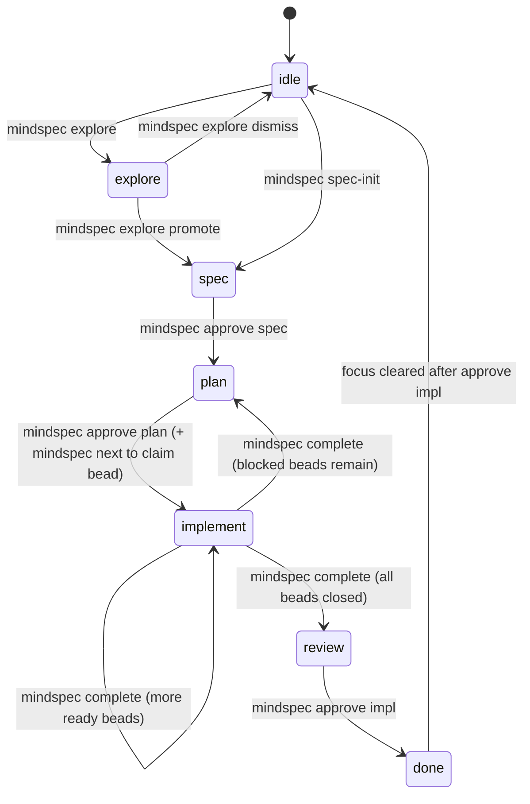

# MindSpec Workflow Architecture: State Machine and Transition Rules

This document defines the intended MindSpec workflow state machine in detail:

1. Which states exist
2. Which transitions are allowed
3. Which transitions are explicitly disallowed
4. Which command(s) trigger each transition
5. Which guards reject invalid transitions

This is the canonical transition contract for workflow behavior.

---

## State Model {#state-model}

MindSpec has two related but distinct state layers:

1. **Per-spec lifecycle phase** (authoritative): `.mindspec/docs/specs/<spec-id>/lifecycle.yaml`
2. **Current focus cursor** (routing): `.mindspec/focus`

And one execution substrate:

3. **Implementation work graph** (execution status): Beads epic + child beads

### 1) Lifecycle Phase (Per Spec, Authoritative)

`lifecycle.yaml` carries the macro phase for one spec:

- `spec`
- `plan`
- `implement`
- `review`
- `done` (terminal for that spec)

### 2) Focus Cursor (Current Working Context)

`.mindspec/focus` carries the active session context:

- `mode`: `idle | explore | spec | plan | implement | review`
- `activeSpec`
- `activeBead`
- `activeWorktree`
- `specBranch`

`idle` and `explore` are focus modes (not per-spec lifecycle phases).  
`done` is a lifecycle phase (not a focus mode).

### 3) Beads Execution Graph

During implementation, state advancement depends on Beads child status under the spec epic:

- Ready children remain -> keep implementing
- Open but blocked children remain -> return to planning context
- No open children remain -> enter review

---

## Workflow States {#workflow-states}

| State | Layer | Meaning |
|:------|:------|:--------|
| `idle` | focus | No active working context selected |
| `explore` | focus | Pre-spec idea evaluation |
| `spec` | lifecycle + focus | Spec authoring and refinement |
| `plan` | lifecycle + focus | Plan authoring and decomposition |
| `implement` | lifecycle + focus | Bead execution in worktrees |
| `review` | lifecycle + focus | Human review/acceptance gate |
| `done` | lifecycle | Spec lifecycle complete |

---

## Canonical Transition Graph (Same Spec) {#canonical-graph}



---

## Allowed Transitions (Detailed) {#allowed-transitions}

| ID | From | To | Trigger | Required Preconditions | Main Effects |
|:---|:-----|:---|:--------|:-----------------------|:-------------|
| T01 | `idle` | `explore` | `mindspec explore "..."` | Focus must be idle/absent | Focus mode set to `explore` |
| T02 | `explore` | `idle` | `mindspec explore dismiss [--adr]` | Must currently be in `explore` | Focus mode set to `idle`; optional ADR for dismissal |
| T03 | `explore` | `spec` | `mindspec explore promote <spec-id>` | Must currently be in `explore`; valid spec ID | Delegates to `spec-init` |
| T04 | `idle` | `spec` | `mindspec spec-init <spec-id>` | Valid spec ID format; worktree setup succeeds | Creates `spec/<id>` branch + worktree, writes `spec.md`, writes `lifecycle.yaml` (`phase: spec`), focus to `spec` |
| T05 | `spec` | `plan` | `mindspec approve spec <spec-id>` | `validate spec` passes | Spec approval written, lifecycle phase -> `plan`, focus -> `plan` |
| T06 | `plan` | `implement` | `mindspec approve plan <spec-id>` then `mindspec next` | `validate plan` passes; implementation beads exist/are created; clean tree for `next` | Lifecycle phase -> `implement`; first bead claimed; bead worktree created; focus -> `implement` |
| T07 | `implement` | `implement` | `mindspec complete` | Active bead resolved; clean tree; bead close succeeds; more ready beads exist | Current bead closed; worktree removed; next bead selected |
| T08 | `implement` | `plan` | `mindspec complete` | Active bead resolved; clean tree; remaining children exist but all blocked | Current bead closed; focus returns to planning context to resolve blockers/scope |
| T09 | `implement` | `review` | `mindspec complete` | Active bead resolved; clean tree; no open implementation beads remain | Current bead closed; focus enters review gate |
| T10 | `review` | `done` (+ focus `idle`) | `mindspec approve impl <spec-id>` | Focus must be `review`; `activeSpec` must match target spec | Lifecycle phase -> `done`; spec branch integration/cleanup; focus cleared to `idle` |

---

## Full Direct-Transition Matrix (Same-Spec Intent) {#matrix}

This matrix is exhaustive for **direct same-spec transitions**.  
If a destination is not listed as allowed, that direct transition is disallowed.

| From | Allowed Direct Next States | Disallowed Direct Next States |
|:-----|:---------------------------|:------------------------------|
| `idle` | `idle`, `explore`, `spec` | `plan`, `implement`, `review`, `done` |
| `explore` | `explore`, `idle`, `spec` | `plan`, `implement`, `review`, `done` |
| `spec` | `spec`, `plan` | `idle`, `explore`, `implement`, `review`, `done` |
| `plan` | `plan`, `implement` | `idle`, `explore`, `spec`, `review`, `done` |
| `implement` | `implement`, `plan`, `review` | `idle`, `explore`, `spec`, `done` |
| `review` | `review`, `done` | `idle`, `explore`, `spec`, `plan`, `implement` |
| `done` | `done` | `explore`, `spec`, `plan`, `implement`, `review` |

Notes:
- `done -> idle` is not a lifecycle phase change; it is focus clearing after completion.
- `implement -> plan` is a blocker-resolution loop (operational fallback), not a gate bypass.

---

## Explicitly Disallowed Transitions and Why {#disallowed}

### Gate-Skipping Transitions (Disallowed)

- `spec -> implement` (must pass spec approval and plan approval first)
- `spec -> review` (cannot skip implementation)
- `plan -> review` (cannot skip implementation)
- `implement -> done` (review + impl approval required)
- `review -> implement` on the same spec as a direct mode jump (requires explicit new scope/beads or review-driven follow-up flow)

### Explore-Mode Misuse (Disallowed)

- Entering explore while not idle
- Dismissing/promoting when not in explore

### Completion/Claim Misuse (Disallowed)

- Running `mindspec next` with a dirty tree
- Running `mindspec complete` with uncommitted bead changes
- Completing without a resolvable active bead/spec

### Multi-Spec Ambiguity (Disallowed Without Targeting)

- Running target-required lifecycle commands without `--spec` when multiple active specs exist and focus cannot disambiguate

### Worktree Policy Violations (Disallowed by Guard Layers)

- Code edits in Spec Mode
- Code edits in Plan Mode
- Any edits in Idle mode
- File writes outside the active worktree in enforced contexts
- Protected-branch commit paths that bypass lifecycle/worktree guards

---

## Command Guard Map {#guard-map}

| Command | Guard Rule(s) | Typical Rejection Condition |
|:--------|:--------------|:----------------------------|
| `mindspec explore` | Must start from idle | Focus already in non-idle mode |
| `mindspec explore dismiss` | Must be in explore | Current mode is not explore |
| `mindspec explore promote` | Must be in explore | Current mode is not explore |
| `mindspec spec-init` | Spec ID format + worktree/branch creation | Invalid ID or worktree setup failure |
| `mindspec approve spec` | `validate spec` must pass | Missing required sections/quality failures |
| `mindspec approve plan` | `validate plan` must pass | Invalid/missing plan structure, missing required sections |
| `mindspec next` | Session freshness gate + clean tree + target disambiguation | Resume/compact session without `--force`, dirty tree, ambiguous active specs |
| `mindspec complete` | Active spec/bead resolution + clean tree | Dirty tree, unresolved bead/spec, close/remove failures |
| `mindspec approve impl` | Must be in review for target spec | Wrong mode or wrong active spec |

---

## Context Switching vs. Same-Spec Transition {#context-switching}

Some transitions that look "invalid" in same-spec terms are valid as **focus switches to a different spec**.

Example:

- `implement` (spec A) -> `spec` (spec B) can be valid when you intentionally interrupt to start a hotfix/new spec in another worktree.

This does **not** mean spec A regressed from implement to spec.  
It means focus moved from spec A to spec B.

Use this rule:

- Same-spec lifecycle transitions must follow the matrix above.
- Cross-spec focus switches are operational routing and may land in a different mode for a different spec.

---

## Recovery and Escape Hatch Behavior {#recovery}

`mindspec state set --mode=...` can force focus to arbitrary values.  
This is a recovery tool, not a normal lifecycle transition mechanism.

Use it only when:

- repairing stale/partial state after interruption
- restoring focus to an already-valid lifecycle state

Do not use it to bypass human gates or skip required commands.

---

## Reference Commands (Happy Path) {#happy-path}

```bash
mindspec explore "idea"                  # optional
mindspec explore promote 123-my-spec     # optional, else spec-init directly
mindspec spec-init 123-my-spec           # if skipping explore
mindspec approve spec 123-my-spec
mindspec approve plan 123-my-spec
mindspec next --spec 123-my-spec
# implement + commit
mindspec complete --spec 123-my-spec     # loop until review
mindspec approve impl 123-my-spec
```

---

## Related Docs {#related}

- [MODES.md](MODES.md)
- [USAGE.md](USAGE.md)
- [CONVENTIONS.md](CONVENTIONS.md)
- [GIT-WORKFLOW.md](GIT-WORKFLOW.md)
- [ADR-0020](../adr/ADR-0020.md)
- [ADR-0019](../adr/ADR-0019.md)
- [ADR-0022](../adr/ADR-0022.md)
