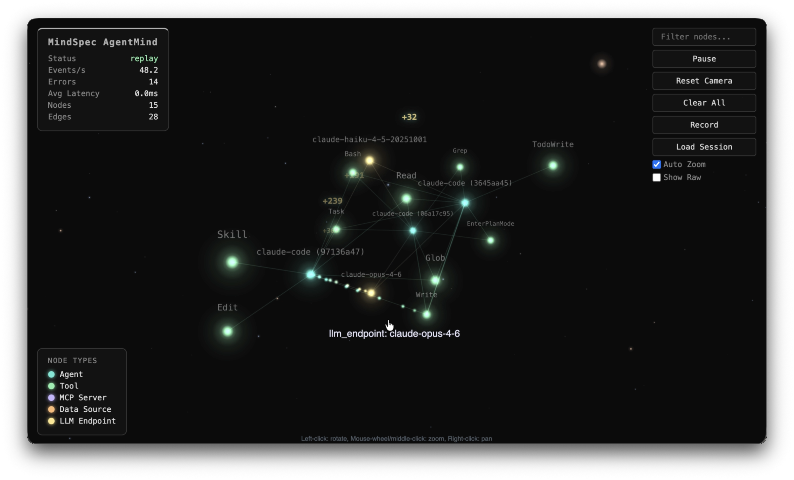

# MindSpec

**Spec-driven development and real-time observability for AI coding agents.**

AI coding agents are powerful but unstructured. Without guardrails they:

- **Drift from intent** — the agent builds what it infers, not what you specified
- **Ignore architecture** — existing design decisions and ADRs get steamrolled
- **Lose context between sessions** — every conversation starts from scratch
- **Skip documentation** — code ships, docs rot
- **Resist scope discipline** — a "small feature" becomes a refactor of three subsystems

MindSpec treats these as system design problems, not prompting problems. It provides a **gated development lifecycle** where architecture divergence is detected and blocked until explicitly resolved, **bounded contexts** borrowed from domain-driven design to manage what the agent sees — deterministic, token-budgeted context packs assembled from domain docs, ADRs, and the Context Map so the agent gets exactly the right context without manual prompt engineering — and an **observability layer** (AgentMind) that shows you exactly what your agent is doing, spending, and how efficiently it's working.

<p align="center">
  
  <br />
  <em>AgentMind — real-time observability for AI coding agents</em>
</p>

## Features

**Lifecycle & Governance**
- **Gated development lifecycle** — Explore, Spec, Plan, Implement, Review — every phase transition requires explicit human approval
- **Explore Mode** — evaluate whether an idea is worth pursuing before committing to a full spec
- **Spec-anchored implementation** — all code traces back to a versioned specification with acceptance criteria
- **Human gates for architecture divergence** — if the agent needs to deviate from an ADR, it stops and escalates
- **Scope discipline** — discovered work becomes new beads (work items), never scope creep in the current task

**Context Engineering**
- **Deterministic context packs** — token-budgeted, DDD-informed bundles of specs, domain docs, and ADRs assembled automatically
- **Domain-driven bounded contexts** — specs declare impacted domains; context packs expand through the Context Map to include neighboring contexts
- **Dynamic agent guidance** — `mindspec instruct` emits mode-appropriate operating instructions at runtime based on current state, replacing static instruction files
- **Architecture Decision Records** — governed ADR lifecycle with auto-numbered IDs, superseding workflow, and mandatory citation in plans

**Workflow Automation**
- **One-command work selection** — `mindspec next` discovers the next ready work item, creates an isolated git worktree, and emits guidance
- **Isolated worktrees** — each work item executes in its own git worktree, scoped to exactly what the plan defined
- **Automated bead creation** — approving a spec or plan automatically creates and links the corresponding work items
- **Doc-sync enforcement** — work items can't close without documentation updates; docs stay current because the system won't let you skip them
- **Validation gates** — `mindspec validate` catches structural issues in specs, plans, and docs before they reach approval
- **Proof runner** — executes validation proof commands from specs and records timestamped pass/fail evidence

**Observability (AgentMind)**
- **3D activity visualization** — agents, tools, MCP servers, and LLM endpoints rendered as an interactive force-directed constellation, updating live
- **Token and cost tracking** — input/output tokens, cache reads, cache creation, and estimated USD cost broken down per model
- **Tool and MCP analytics** — every tool call and MCP server interaction counted and categorized with frequency histograms
- **Session recording and replay** — capture full sessions as NDJSON, replay at any speed, filter by lifecycle phase
- **A/B/C benchmarking** — compare agentic workflows side-by-side with automated delta reporting and qualitative analysis
- **Multi-agent identity** — distinct visualization nodes for each agent and sub-agent with parent-child hierarchy

**Project Setup & Integration**
- **One-command bootstrap** — `mindspec init` scaffolds the full project structure; additive and safe for existing repos
- **Brownfield onboarding** — analyzes existing docs and migrates them into canonical MindSpec structure with full provenance
- **Claude Code integration** — `mindspec setup claude` configures hooks, slash commands, plan gates, and CLAUDE.md automatically
- **Codex support** — first-class workflow for OpenAI Codex CLI with the same gated lifecycle
- **Copilot support** — first-class workflow for GitHub Copilot users in both CLI and VS Code Chat
- **OTLP-compatible** — any agent that speaks OpenTelemetry can feed AgentMind; not locked to a single agent

## The Workflow

Every phase transition requires explicit human approval:

```
             ┌─ dismiss ─→ Idle
Idle ──→ [Explore Mode]
             └─ promote ─→ Spec Mode ──gate──→ Plan Mode ──gate──→ Implementation ──→ Review ──gate──→ Idle
```

**Explore Mode** (optional) — Evaluate whether an idea is worth pursuing. The agent clarifies the problem, checks prior art, assesses feasibility, and recommends whether to proceed or dismiss. No specs or code — just structured conversation.

**Spec Mode** — Define what "done" looks like. Problem statement, acceptance criteria, impacted domains, ADR touchpoints. No code allowed.

**Plan Mode** — Decompose the spec into bounded work chunks. Review applicable ADRs. Check architectural fitness. If implementation needs to deviate from a cited ADR, the agent stops and escalates — you approve a superseding ADR or reject the divergence.

**Implementation Mode** — Execute in an isolated git worktree. One bead per worktree, scoped to exactly what the plan defined. Doc-sync is mandatory. Discovered work becomes new beads, not scope creep.

**Review Mode** — Validate against the original spec's acceptance criteria. Human approves to return to idle.

The work graph is tracked by [Beads](https://github.com/steveyegge/beads), a git-native issue tracker that survives across sessions without external services.

Documentation stays current because the system won't let you skip it — beads can't close without doc-sync, architecture decisions are tracked as ADRs that plans must cite, and every spec produces versioned artifacts that persist alongside the code.

---

## Quickstart

```bash
# 1. Install (download from GitHub Releases)
# https://github.com/mrmaxsteel/mindspec/releases
# or build from source: make build && cp ./bin/mindspec /usr/local/bin/

# 2. Bootstrap your project
cd your-project
mindspec init
mindspec setup claude   # Or: codex, copilot — configures hooks + skills
```

`mindspec init` scaffolds the `.mindspec/` directory, `AGENTS.md`, and the project structure. `mindspec setup claude` adds Claude Code-specific integration (SessionStart hook, plan gates, and skills). From here, your coding agent picks up the workflow automatically — the SessionStart hook runs `mindspec instruct` and the agent knows what to do.

Tell the agent what you want to build. It will walk you through the lifecycle:

1. **Explore** — "I have an idea about X" (agent evaluates feasibility, you decide go/no-go)
2. **Spec** — Agent drafts the spec, you approve with `/ms-spec-approve`
3. **Plan** — Agent decomposes into work chunks, you approve with `/ms-plan-approve`
4. **Implement** — Agent codes in isolated worktrees, scoped to the plan
5. **Review** — Agent verifies acceptance criteria, you approve with `/ms-impl-approve`

### Guides

| Goal | Guide |
|:-----|:------|
| **Full workflow with Claude Code** | [Claude Code guide](.mindspec/docs/user/guides/claude-code.md) |
| **Full workflow with Codex** | [Codex guide](.mindspec/docs/user/guides/codex.md) |
| **Full workflow with Copilot** | [Copilot guide](.mindspec/docs/user/guides/copilot.md) |
| **Visualize & benchmark agent activity** | [AgentMind guide](.mindspec/docs/user/guides/agentmind.md) |
| **Workflow state machine (allowed/disallowed transitions)** | [WORKFLOW-STATE-MACHINE.md](.mindspec/docs/core/WORKFLOW-STATE-MACHINE.md) |
| **Complete reference** | [USAGE.md](.mindspec/docs/core/USAGE.md) |

## Project Structure

```
your-project/
├── .mindspec/
│   ├── config.yaml             # MindSpec + Beads configuration
│   └── docs/
│       ├── core/               # USAGE.md, MODES.md, ARCHITECTURE.md, etc.
│       ├── adr/                # Architecture Decision Records
│       ├── domains/            # Bounded context documentation
│       └── specs/              # Versioned specifications and plans
├── .beads/                     # Beads work graph (committed)
├── .claude/                    # Claude Code config (created by mindspec setup claude)
│   ├── settings.json           # Hooks (SessionStart, PreToolUse gates)
│   ├── commands/               # Custom slash commands
│   └── skills/                 # Skills (/ms-spec-create, /ms-spec-approve, etc.)
├── AGENTS.md                   # Cross-agent workflow conventions
└── CLAUDE.md                   # Claude Code-specific config
```

## Tested Against Real Agents

MindSpec's workflow is continuously validated by a behavioral test harness that runs real LLM agents through every lifecycle phase. An iterative test-observe-measure-improve cycle tracks forward ratio, retry count, and wasted turns — then feeds failures back into MindSpec's own guidance layer until the agent gets it right. The result is a framework where your agent reliably follows the workflow, stays architecturally sound, and spends its turns on productive work instead of recovery.

## Design Principles

1. **Docs-first** — every code change updates documentation, enforced by the system
2. **Spec-anchored** — all implementation traces back to a versioned specification
3. **Human gates for divergence** — architecture deviations require approval and a new ADR
4. **Proof of done** — beads close only with verification evidence
5. **Scope discipline** — discovered work becomes new beads, never scope creep
6. **Dynamic over static** — runtime guidance beats static files that drift
7. **CLI-first** — logic lives in testable, versionable Go; IDE integrations are thin shims
8. **Deterministic context** — token-budgeted context packs, not "go read this file" prompting

## Requirements

- Go 1.22+
- [Beads](https://github.com/steveyegge/beads) CLI (`bd`)
- Git (for worktree support)
- Claude Code or Codex (for agent integration; MindSpec is CLI-first and works standalone)

## Building

```bash
make build      # Build to ./bin/mindspec
make test       # Run all tests
make install    # Install to $GOPATH/bin
```

## License

MIT
