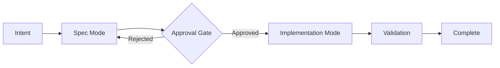

# Mindspec Operational Modes

This document defines the two operational modes that govern how agents and developers interact with the mindspec-managed development workflow.

## Overview

Mindspec enforces a **gated lifecycle** where specification must precede implementation. This is mechanically enforced through two distinct modes:



---

## Spec Mode {#spec-mode}

### Definition

**Spec Mode** is the initial phase where intent is captured, requirements are formalized, and the specification is refined until it meets acceptance criteria.

### Permitted Artifacts

In Spec Mode, **only markdown and configuration artifacts** may be created or modified:

| Artifact | Location | Purpose |
| :------- | :------- | :------ |
| `spec.md` | `docs/specs/<id>/` | Formal specification |
| `tasks.json` | `docs/specs/<id>/` | Task graph definition |
| `context-pack.md` | `docs/specs/<id>/` | Injected context provenance |
| Glossary entries | `GLOSSARY.md` | New term definitions |
| Architecture docs | `docs/core/`, `docs/features/` | Context/rationale |

### Forbidden Actions

- **No code changes** in `src/` or equivalent implementation directories
- **No test code** (tests accompany implementation)
- **No build/config changes** that affect runtime behavior

### Exit Criteria

To transition out of Spec Mode, the specification must:

1. Have all **Acceptance Criteria** explicitly defined
2. Have all Acceptance Criteria marked as **verifiable** (not vague)
3. Receive **human approval** (explicit sign-off)

---

## Implementation Mode {#implementation-mode}

### Definition

**Implementation Mode** is the phase where code is written to fulfill an approved specification. It is entered **only** after passing the Approval Gate.

### Permitted Artifacts

All artifacts are permitted, including:

- Source code (`src/**/*`)
- Tests (`tests/**/*`)
- Build configuration
- Documentation updates (doc-sync requirement still applies)

### Prerequisites

Implementation Mode **requires**:

1. A linked `spec.md` with status `APPROVED`
2. All Acceptance Criteria defined and understood
3. Human approval recorded in the spec

### Obligations

While in Implementation Mode:

- **Doc Sync**: Any code change must update corresponding documentation
- **Proof of Done**: Tasks complete only when validation proofs pass
- **Scope Discipline**: Changes must stay within the spec's defined scope
- **Divergence Protocol**: Architecture deviations trigger ACP and halt

---

## Transition Criteria {#transition-criteria}

The transition from Spec Mode to Implementation Mode is a **gated checkpoint**.

### Acceptance Criteria Quality

A spec's acceptance criteria must be:

| Quality | Description |
| :------ | :---------- |
| **Specific** | Each criterion describes a single, concrete outcome |
| **Measurable** | Can be verified via automated proof or manual test |
| **Complete** | All requirements are covered; no implicit ones |
| **Unambiguous** | No room for interpretation |

### Approval Protocol

```markdown
## Approval

- **Status**: APPROVED
- **Approved By**: @username
- **Approval Date**: 2026-01-31
- **Notes**: (optional reviewer comments)
```

Valid status values:

| Status | Meaning |
| :----- | :------ |
| `DRAFT` | Work in progress, not ready for review |
| `PENDING_REVIEW` | Ready for human review |
| `APPROVED` | Cleared for implementation |
| `REJECTED` | Requires revision before approval |

---

## Mode Enforcement

### Policy Integration

Mode enforcement is defined in `architecture/policies.yml`:

- `spec-mode-no-code`: Blocks code changes while in Spec Mode
- `implementation-requires-approved-spec`: Blocks implementation without approval

### Validation

- `mindspec validate mode` — Reports current mode and any violations
- `mindspec validate spec <id>` — Checks acceptance criteria quality

---

## Rationale

This mode system ensures:

1. **Deliberate Design**: Implementation cannot begin without clear intent
2. **Human Oversight**: Approval gate prevents autonomous runaway
3. **Quality Baseline**: Acceptance criteria force specificity upfront
4. **Audit Trail**: Approval status and reviewer are recorded in the spec

---

## See Also

- [ARCHITECTURE.md](file:///Users/Max/Documents/mindspec/docs/core/ARCHITECTURE.md) — Core system design
- [policies.yml](file:///Users/Max/Documents/mindspec/architecture/policies.yml) — Machine-checkable policies
- [CONVENTIONS.md](file:///Users/Max/Documents/mindspec/docs/core/CONVENTIONS.md) — File organization
